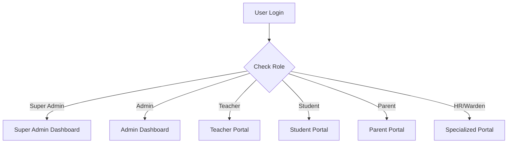

## 1. Product Overview
A full-fledged multi-tenant School Management Software designed to handle the comprehensive administrative, academic, and financial operations of educational institutions.
- This platform provides a centralized, SaaS-based solution where a Super Admin manages multiple schools, while individual schools operate in an isolated environment. It serves administrators, teachers, students, parents, HR, and other specialized roles with dedicated, widget-heavy, responsive dashboards.
- The target value is to streamline school operations, improve communication between stakeholders, and provide real-time data insights to decision-makers.

## 2. Core Features

### 2.1 User Roles
| Role | Registration Method | Core Permissions |
|------|---------------------|------------------|
| Super Admin | System Provisioned | Manage schools, global subscriptions, system settings |
| Admin | Super Admin Provisioned | Manage school-level operations, users, academics, and finances |
| Teacher | Admin Provisioned | Manage classes, attendance, assignments, and grades |
| Student | Admin Provisioned | View courses, timetable, grades, notices, and fees |
| Parent | Admin Provisioned | Monitor children's academic progress, attendance, and pay fees |
| HR Manager | Admin Provisioned | Manage staff, attendance, leaves, and payroll |
| Hostel Warden | Admin Provisioned | Manage rooms, allocations, visitors, and maintenance |

### 2.2 Feature Module
1. **Super Admin Dashboard**: Schools management, subscriptions, global revenue overview.
2. **Admin Dashboard**: School overview, student/teacher management, fee collection, announcements.
3. **Teacher Portal**: Class management, grading, attendance tracking, scheduling.
4. **Student Portal**: Course access, exam countdown, grades, assignments.
5. **Parent Portal**: Children overview, fee payment, attendance monitoring, communication.
6. **HR Portal**: Employee management, payroll, leave requests.
7. **Hostel Portal**: Room occupancy, maintenance requests, hostel fees.

### 2.3 Page Details
| Page Name | Module Name | Feature description |
|-----------|-------------|---------------------|
| Super Admin Dashboard | Overview | Key metrics (total schools, revenue), revenue chart, recent registrations |
| Admin Dashboard | School Overview | Student/teacher stats, fee collection charts, top classes |
| Teacher Portal | Teaching Overview | Class performance charts, to-do lists, today's schedule |
| Student Portal | Academic Journey | Current CGPA, exam countdown, recent results, timetable |
| Parent Portal | Child Dashboard | Attendance overview, fee summary with payment action, recent updates |
| HR Portal | Staff Overview | Attendance charts, payroll summary, leave request approvals |
| Hostel Portal | Accommodation | Room occupancy doughnut chart, maintenance alerts, recent check-ins |

## 3. Core Process
User authentication flow and role-based routing.

## 4. User Interface Design
### 4.1 Design Style
- Primary Colors: Deep Navy Blue (`#0F172A`) for sidebars, vibrant Royal Blue (`#2563EB`) for active states/buttons.
- Secondary Colors: Soft White/Gray (`#F8FAFC`) for backgrounds, clean White (`#FFFFFF`) for cards. Success Green (`#10B981`), Warning Orange (`#F59E0B`), Danger Red (`#EF4444`).
- Button style: Soft rounded corners, subtle shadow on hover, flat solid colors.
- Font and sizes: Modern sans-serif like 'Inter' or 'Plus Jakarta Sans'. High readability for data-heavy views.
- Layout style: Sidebar navigation on the left, top header for profile/notifications, masonry/grid-based KPI cards and charts in the main content area.
- Icon style: Clean, consistent stroke icons (e.g., Lucide or Heroicons).

### 4.2 Page Design Overview
| Page Name | Module Name | UI Elements |
|-----------|-------------|-------------|
| All Dashboards | Layout | Fixed left sidebar (dark), top header (light), gray background |
| Dashboards | KPI Cards | White background, rounded corners, subtle shadow, icon + metric |
| Dashboards | Charts | Recharts/Chart.js integration, clean tooltips, responsive sizing |
| Data Tables | Lists | Minimal borders, alternating row colors, clear action buttons |

### 4.3 Responsiveness
Desktop-first approach (as dashboards are complex), but fully mobile-adaptive with collapsible sidebars and stacked grid layouts for smaller screens.