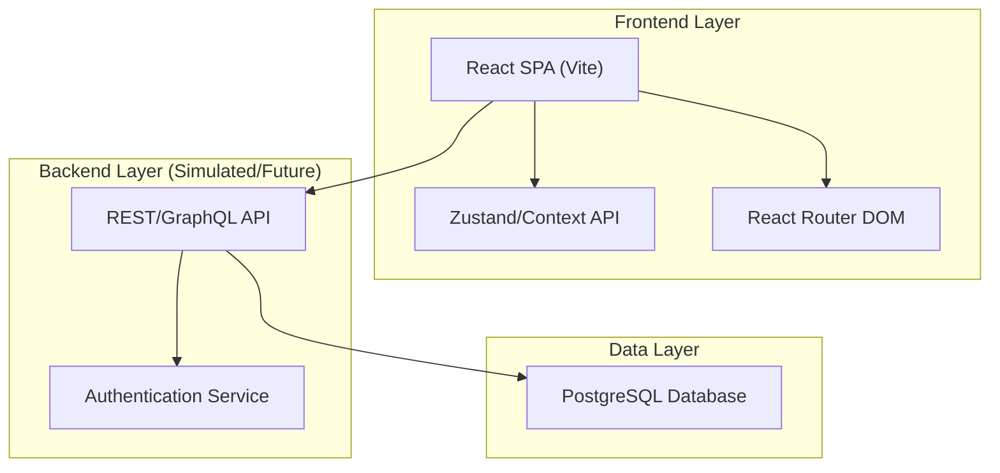
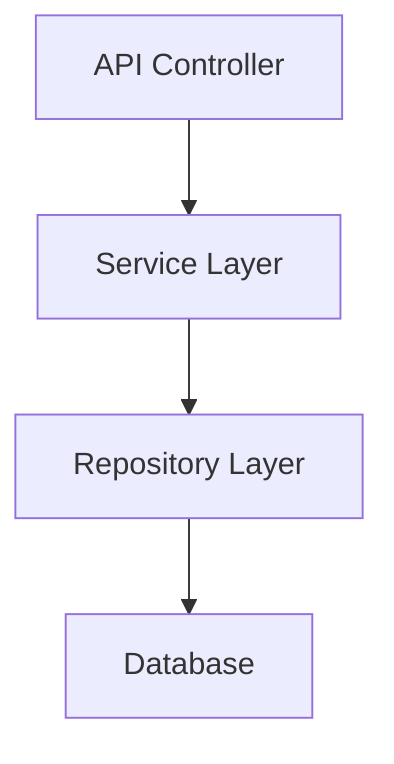

## 1. Architecture Design


## 2. Technology Description
- Frontend: React@18 + tailwindcss@3 + vite
- Routing: react-router-dom@6
- Icons: lucide-react
- Charts: recharts
- Initialization Tool: vite-init (npm create vite@latest)

## 3. Route Definitions
| Route | Purpose |
|-------|---------|
| / | Login / Authentication |
| /super-admin | Super Admin Dashboard |
| /admin | School Admin Dashboard |
| /teacher | Teacher Portal |
| /student | Student Portal |
| /parent | Parent Portal |
| /hr | HR Manager Portal |
| /hostel | Hostel Warden Portal |

## 4. API Definitions (if backend exists)
```typescript
interface User {
  id: string;
  name: string;
  role: 'SUPER_ADMIN' | 'ADMIN' | 'TEACHER' | 'STUDENT' | 'PARENT' | 'HR' | 'WARDEN';
  email: string;
  avatar?: string;
}

interface KPI {
  title: string;
  value: string | number;
  trend?: number;
  trendLabel?: string;
}
```

## 5. Server Architecture Diagram (if backend exists)


## 6. Data Model (if applicable)
### 6.1 Data Model Definition
```mermaid
erDiagram
    SCHOOL ||--o{ USER : "has"
    USER ||--o{ ROLE : "assigned"
    SCHOOL ||--o{ CLASS : "contains"
    CLASS ||--o{ STUDENT : "enrolls"
    CLASS ||--o{ TEACHER : "taught by"
```

### 6.2 Data Definition Language
(Not fully applicable yet as we are focusing on the frontend dashboards setup)
